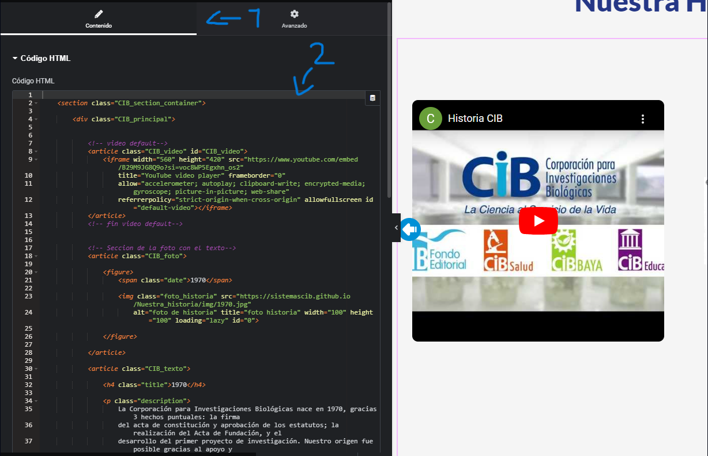
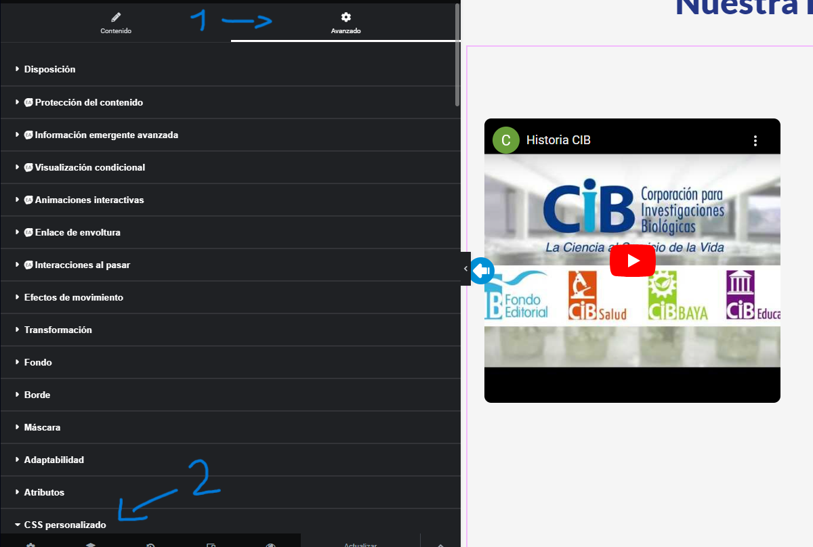
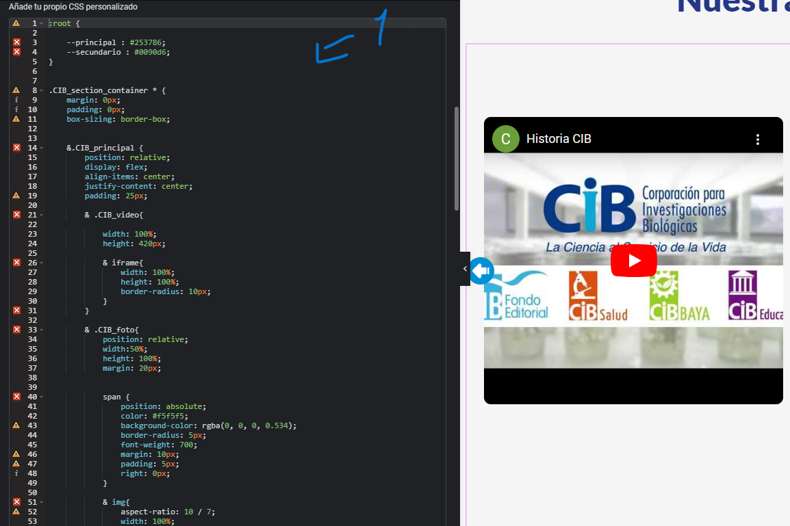
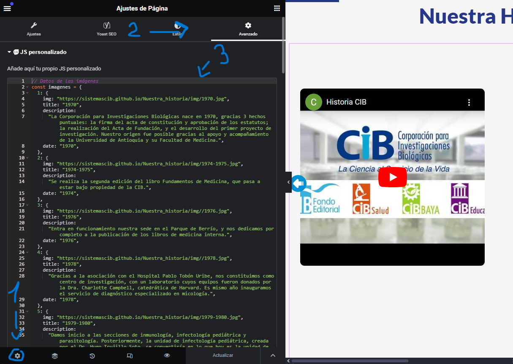

# Documentacion de nuetra historia

## codigo de linea de tiempo anterior
```html
<iframe src='https://cdn.knightlab.com/libs/timeline3/latest/embed/index.html?source=1M379UJt2-XlmptCI-IUXt0JhmRBG8xN1rkEzy7OcDc0&font=Default&lang=es&initial_zoom=2&height=650' width='100%' height='650' webkitallowfullscreen mozallowfullscreen allowfullscreen frameborder='0'></iframe>

```

En esta pequeña documentacion te explicare los pasos para poder implementar el codigo a wordpress y que se muestre tal cual.

cabe acalarar los archivos y directorios que se encuentran alojados, tambien se pueden vsualizar en el archivo "estructura.MD":

> carrusel_historia.js. Este se encarga de alojar el codigo en javascript

> index.html : Este contiene la estructura de toda la maquetacion

> styles.css: Este archivo contiene los estilos proporsionados para el codigo

## codigo base de HTML

### video por defecto
```html
<article class="CIB_video" id="CIB_video">// 1
    // 2 <iframe width="560" height="420" src="https://www.youtube.com/embed/B29M9JG8Q9o?si=voc8WP5Egxhn_os2"
        title="YouTube video player" frameborder="0"
        allow="accelerometer; autoplay; clipboard-write; encrypted-media; gyroscope; picture-in-picture; web-share"
        referrerpolicy="strict-origin-when-cross-origin" allowfullscreen id="default-video"></iframe>
</article>
```
- Este codigo se estructura de la siguente manera:

1 - Article: contenedor del video
2 - iframe : Este eria el video que se cargara


### imagen principal con la fecha
```html
<article class="CIB_foto"> // 1

    <figure> // 2
        <span class="date">1970</span> // 3

        // 4 

    </figure>

</article>
```
- Este codigo se estructura de la siguiente manera: 

1 - article: contenedor de la imagen grande o principal
2 - figure: contenedor de la imagen
3 - span: este muestra la fecha de la foto o historia
4 - img: Imagen principal que se mostrara


### seccion del texto principal
```html
<article class="CIB_texto"> // 1

    <h4 class="title">1970</h4> // 2

    <p class="description"> // 3
        La Corporación para Investigaciones Biológicas nace en 1970, gracias 3 hechos puntuales: la firma
        del acta de constitución y aprobación de los estatutos; la realización del Acta de Fundación, y el
        desarrollo del primer proyecto de investigación. Nuestro origen fue posible gracias al apoyo y
        acompañamiento de la Universidad de Antioquia y su Facultad de Medicina.
    </p>

</article>
```
1 - article: contenedor que encierra el texto y el titulo
2 - h4: titulo de la historia o fecha en que se ejecuto
3 - p: Parrafo que describe lo que se ejecuto ese año


### imagenes miniatura
```html
<article class="CIB_miniaturas">
    <!-- aqui imagenes generadas con el js-->
</article>
```

Este codigo es el contenbedor de las miniaturas, esta vacio ya que se cargan dinamicamente con js.


## Codigo base de estilos

> se recomienda para evitar erroes de estilos y conflictos con los estilos bases de wordpress. poner un prefijo antes de declarar sus clases o id's, ya que posiblemente se puede compartir el mismo nombre de la clase.

```css

    //forma correcta
    .CIB_video{
        width: 100%;
        height: 420px;
    } 

    // forma incorrecta
    .video{
        /*estilos...*/
    }


    //forma correcta
    .CIB_span{
        width: 100%;
        height: 420px;
    } 

    // forma incorrecta
    .span{
        /*estilos...*/
    }

    // forma incorrecta
    span{
        /*estilos...*/
    }

```

## codigo base de javascrpit

> El codigo esta alojado en un archivo aparte del html, este se encarga de generar las miniaturas y la iteracion con el carrusel, la explicacion de cada de sus metodos estaran establecidos en el mismo codigo.

# como subir archivos a wordpress de la manera correcta.

> Aca podras ver como poder subir codigo html, css y js de la mejor manera a wordpress, cabe aclarar que no es la unica manera en subir archivos a wordpress. existen diversas maneras pero esta seria la mas sencilla y la mas acorde a las necesidades.


# paso 1

## incrustar el codigo html


## incrustar el css



## incrustar el js
